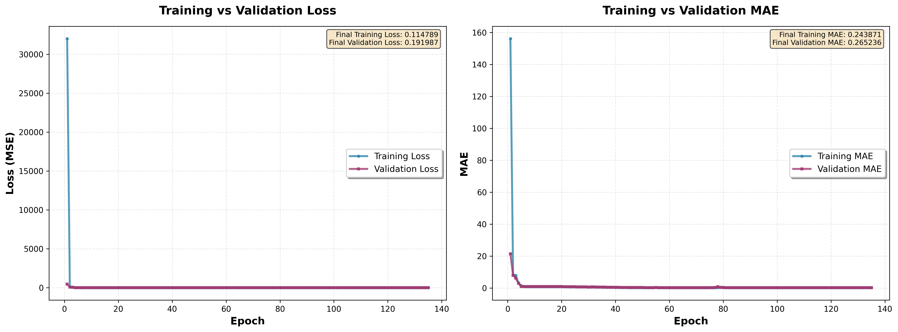
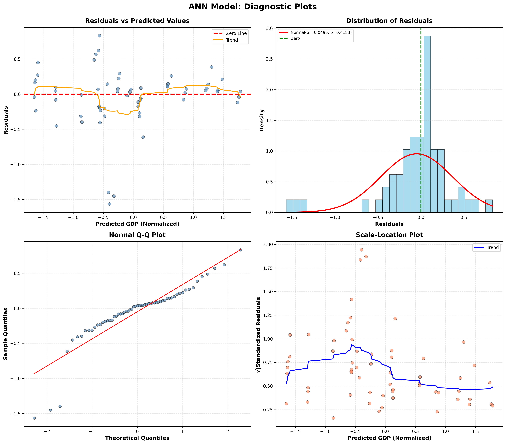
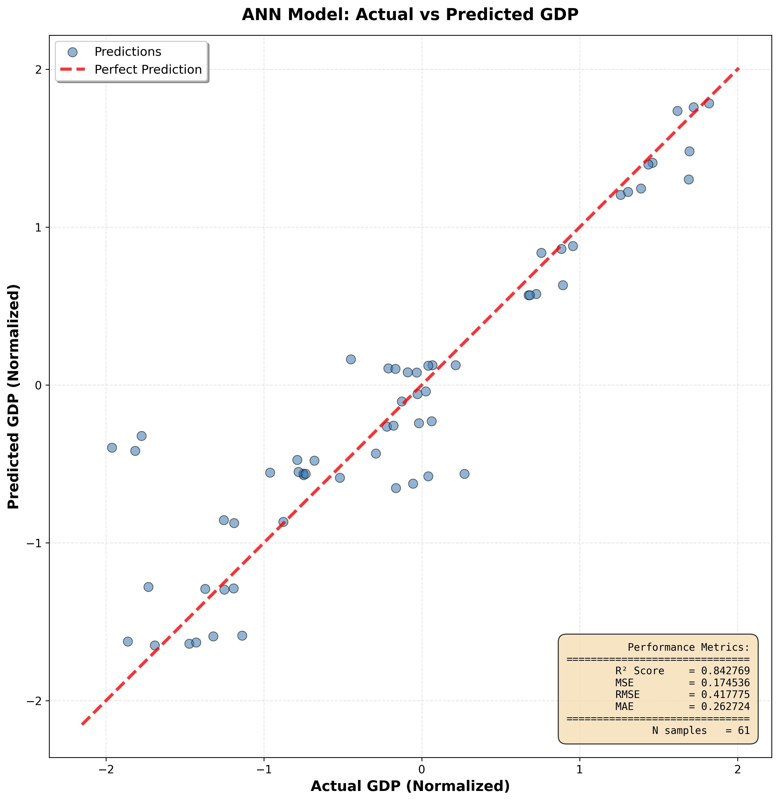

---

# ANN Model Training for GDP Prediction

**AI-Based Economic Forecast Across German States**

**Authors:** Rohith Boggula, Rakesh Adepu
**Course:** Advanced AI-based Application Systems – Business Information Systems
**Institution:** University of Potsdam

---

## Course Information

This project is developed as part of the course
**“M. Grum: Advanced AI-based Application Systems”**
Business Information Systems, esp. AI-based Application Systems
Junior Chair for Business Information Science, esp. AI-based Application Systems
University of Potsdam

---

## 1. Project Overview

This project implements an **Artificial Neural Network (ANN)** to predict **GDP values across German states** based on socio-economic indicators.
The model is trained, evaluated, and documented with **comprehensive visualizations**, following the methodology discussed in the course exercises.

The complete training pipeline includes:

* Model training and validation
* Performance evaluation on unseen test data
* Diagnostic analysis using residual-based plots
* Visualization of actual vs. predicted GDP values

All outputs are stored in the directory:

```
/documentation/ann_visualizations/
```

---

## 2. Data Configuration

### Dataset Overview

* **Training samples:** 243
* **Test samples:** 61

### Feature & Target Definition

* **Features:**

  * `population`
  * `employment`
  * `year`

* **Target:**

  * `gdp`

### Data Shapes

| Split   | Shape    |
| ------- | -------- |
| X_train | (243, 3) |
| X_test  | (61, 3)  |

---

## 3. ANN Model Architecture

The ANN is implemented using **TensorFlow / Keras** with a fully connected feedforward structure:

| Layer         | Type   | Units |
| ------------- | ------ | ----- |
| Input → Dense | ReLU   | 64    |
| Dense         | ReLU   | 32    |
| Dense         | ReLU   | 16    |
| Output        | Linear | 1     |

**Total parameters:** 2,881
**Trainable parameters:** 2,881

This architecture balances model expressiveness with generalization capability.

---

## 4. Training Configuration

* **Optimizer:** Adam
* **Loss function:** Mean Squared Error (MSE)
* **Metric:** Mean Absolute Error (MAE)
* **Maximum epochs:** 500
* **Early stopping:** Enabled
* **Actual epochs trained:** **135**

---

## 5. Training & Validation Performance

### Final Training Statistics

* **Epochs completed:** 135
* **Final training loss (MSE):** 0.114789
* **Final validation loss (MSE):** 0.191987
* **Final training MAE:** 0.243871
* **Final validation MAE:** 0.265236

The best validation performance occurred around **epoch 85**, after which early stopping prevented overfitting .

---

## 6. Training & Validation Curves

The following plot illustrates the **training and validation loss/MAE** across epochs:

### (1) Training vs Validation Curves



**Observations:**

* Rapid convergence in early epochs
* Stable validation curve with minimal divergence
* No significant overfitting detected

---

## 7. Diagnostic Plots (ANN)

To assess model assumptions and error behavior, diagnostic plots were generated:

### (2) Diagnostic Plots



Included analyses:

* **Residuals vs Predicted Values**
* **Distribution of Residuals**
* **Normal Q-Q Plot**
* **Scale–Location Plot**

**Residual statistics:**

* Mean ≈ −0.049
* Std ≈ 0.418

Residuals are approximately normally distributed, supporting good model fit.

---

## 8. Actual vs Predicted GDP (Scatter Plot)

### (3) Scatter Plot: Actual vs Predicted GDP



**Key metrics (Test Set):**

* **R² Score:** 0.842769
* **RMSE:** 0.417775

Most points closely follow the diagonal (perfect prediction line), indicating strong predictive accuracy.

---

## 9. Model Evaluation Results

### Training Set Performance

* **MSE:** 0.087141
* **MAE:** 0.219942
* **R²:** 0.909651

### Test Set Performance

* **MSE:** 0.174536
* **RMSE:** 0.417775
* **MAE:** 0.262724
* **R²:** 0.842769

**Overall assessment:**
The ANN demonstrates **excellent generalization** with a high test R² score and stable error metrics .

---

## 10. Saved Outputs (`/documentation/ann_visualizations`)

All required artifacts are stored and documented:

```
learningBase/
├── 1_training_validation_curves.png
├── 2_diagnostic_plots_ann.png
├── 3_scatter_plot_ann.png
├── currentAiSolution.h5
└── training_summary.txt
```

* `currentAiSolution.h5` – trained ANN model
* `training_summary.txt` – complete numerical training report 

---

## 11. Conclusion

This ANN-based GDP forecasting model achieves **strong predictive performance** and satisfies all exercise requirements:

* Documented training iterations
* Final loss and accuracy metrics
* Training/testing curves
* Diagnostic plots
* Scatter plots
* Fully reproducible outputs


---
