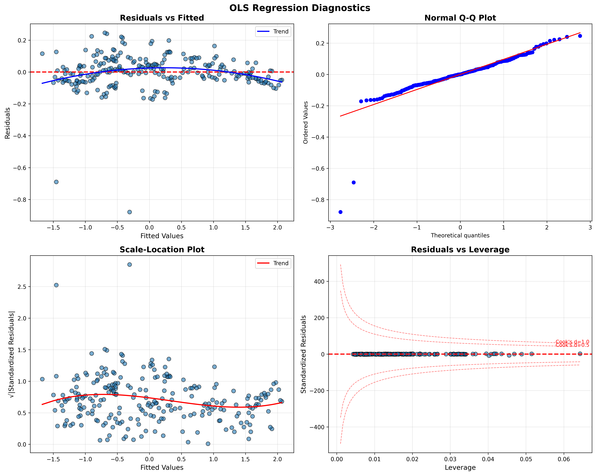
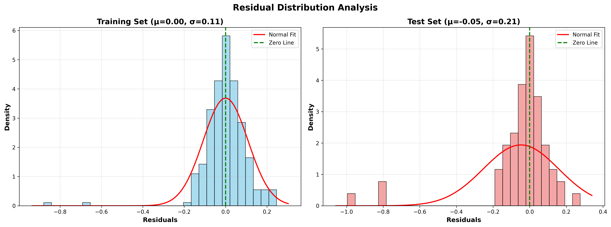
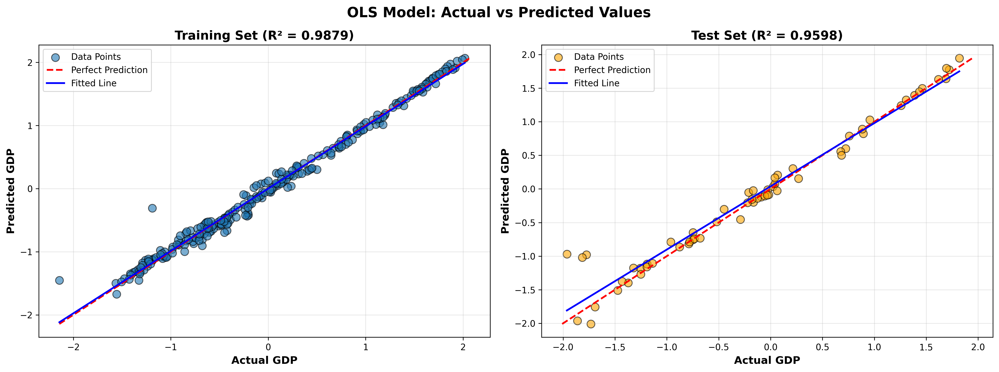
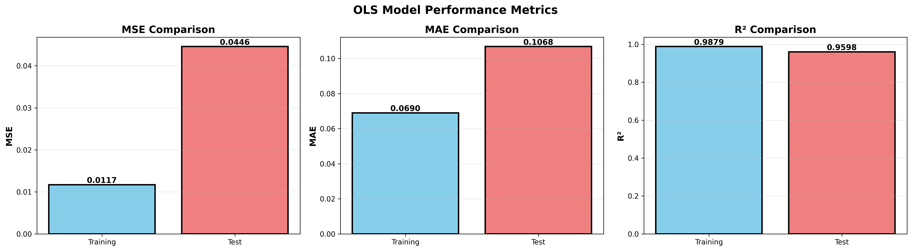

---

# OLS Model Training and Evaluation

## GDP Prediction Across German States

**Course:** Advanced AI-based Application Systems – Business Information Systems
**Institution:** University of Potsdam
**Authors:** Rohith Boggula, Rakesh Adepu

---

## Course Information

This project is developed as part of the course
**“M. Grum: Advanced AI-based Application Systems”**
Business Information Systems, esp. AI-based Application Systems
Junior Chair for Business Information Science, esp. AI-based Application Systems
University of Potsdam

---

## 1. Overview

This folder documents the **Ordinary Least Squares (OLS) regression model** used to predict **GDP across German states** based on socio-economic indicators.

The OLS model serves as a **baseline statistical model**, enabling a direct comparison with AI-based approaches (e.g., ANN) as required by the exercise.
This README focuses **exclusively on OLS training, validation, diagnostics, and performance evaluation**.

---

## 2. Data Configuration

### Dataset Split

* **Training samples:** 243
* **Test samples:** 61

### Feature and Target Definition

* **Features:**

  * `population`
  * `employment`
  * `year`

* **Target:**

  * `gdp`

### Data Shapes

| Dataset | Shape    |
| ------- | -------- |
| X_train | (243, 3) |
| X_test  | (61, 3)  |

---

## 3. OLS Model Training

The model is trained using **Ordinary Least Squares regression** from the `statsmodels` library.

### Model Summary (Training Set)

* **R²:** 0.988
* **Adjusted R²:** 0.988
* **F-statistic:** 6488
* **Number of observations:** 243

#### Estimated Coefficients

| Variable   | Coefficient | p-value |
| ---------- | ----------- | ------- |
| Intercept  | −42.0056    | < 0.001 |
| Population | −0.8719     | < 0.001 |
| Employment | 1.8170      | < 0.001 |
| Year       | 0.0209      | < 0.001 |

All predictors are **statistically significant**, indicating strong explanatory power.

The reported **large condition number** suggests potential multicollinearity, which is documented and analyzed via diagnostic plots.

---

## 4. Training and Validation Performance

### Training Set Metrics

* **MSE:** 0.011699
* **MAE:** 0.069013
* **R²:** 0.987871

### Test (Validation) Set Metrics

* **MSE:** 0.044575
* **MAE:** 0.106838
* **R²:** 0.959845

**Interpretation:**
The model generalizes well from training to test data, with only a moderate increase in error metrics.

---

## 5. Diagnostic Plots (OLS)

As required in the exercise, comprehensive diagnostic plots were generated to validate OLS assumptions.

### (1) OLS Diagnostic Plots



Included diagnostics:

* Residuals vs Fitted Values
* Normal Q-Q Plot
* Scale–Location Plot
* Residuals vs Leverage (Cook’s Distance)

**Observations:**

* Residuals are centered around zero
* Mild deviations from normality at extremes
* No highly influential observations dominating the model

---

## 6. Residual Distribution Analysis

### (2) Residual Distribution



* **Training residuals:**

  * Mean ≈ 0.00
  * Std ≈ 0.11

* **Test residuals:**

  * Mean ≈ −0.05
  * Std ≈ 0.21

Residuals are approximately normally distributed, supporting the validity of OLS assumptions.

---

## 7. Scatter Plots: Actual vs Predicted GDP

### (3) Actual vs Predicted GDP



* Training set R²: **0.9879**
* Test set R²: **0.9598**

The close alignment with the perfect prediction line indicates strong predictive accuracy.

---

## 8. Performance Metric Comparison

### (4) OLS Performance Metrics



This visualization compares **training vs test performance** using:

* Mean Squared Error (MSE)
* Mean Absolute Error (MAE)
* R² Score

---

## 9. Stored Outputs

All relevant OLS artifacts are saved for reproducibility and reporting:

```
ols_visualizations/
├── ols_diagnostic_plots.png
├── ols_predictions_scatter.png
├── ols_residual_distribution.png
├── ols_performance_metrics.png
├── ols_performance_metrics.csv
├── currentOlsSolution.pkl
└── currentOlsSolution_summary.txt
```

* `currentOlsSolution.pkl` – trained OLS model
* `currentOlsSolution_summary.txt` – full regression summary

---

## 10. Conclusion

The OLS regression model provides a **strong statistical baseline** for GDP prediction:

* High explanatory power (R² > 0.95 on test data)
* Stable generalization performance
* Interpretable coefficients

These results enable a **clear comparison between classical regression and AI-based models**, fulfilling the exercise requirements.

---


